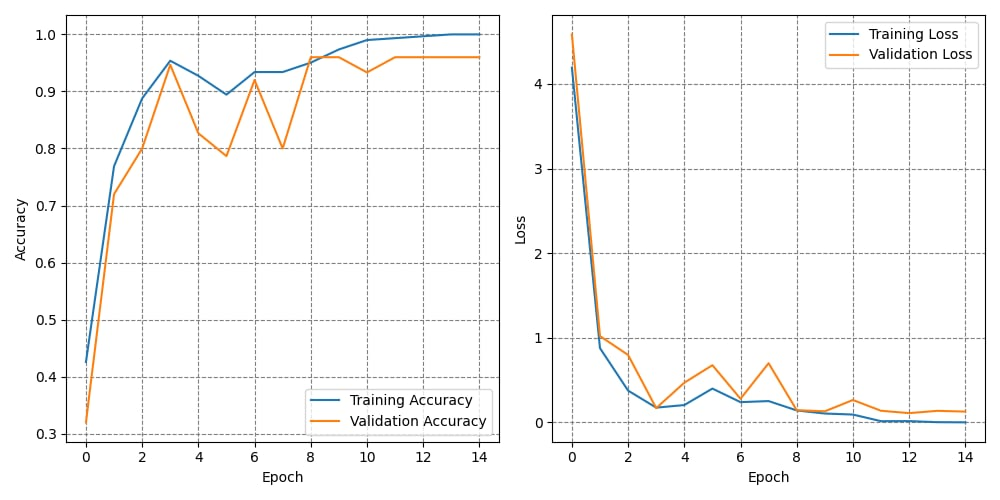
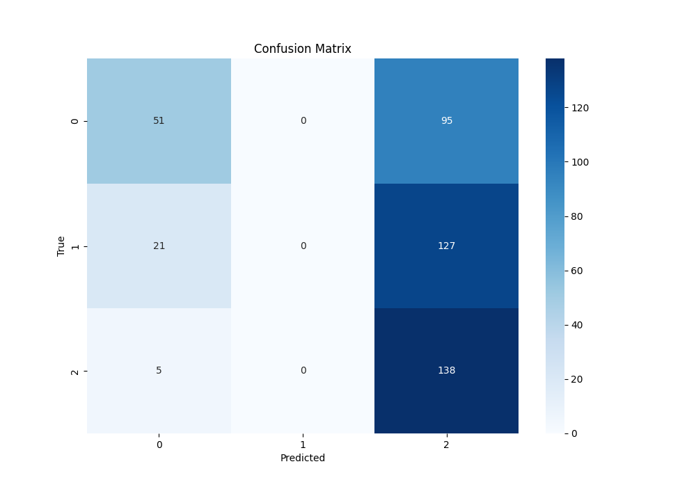

# Aplikacja - sterowanie ruchem

Projekt zawiera 3 modele, programy treningowe oraz proste gry wykorzystujące rozponawanie ruchu i gestów. Modele zostały wytrenowane na 100, 700 i 2000 zdjęć pobranych z 3 datasetow.

### Projekt zawiera 3 modele.

## Model 1

Pierwszy model trenowany był z użyciem transfer learningu(model YOLOv8) na 100 zdjęciach w rozdzielczości 540x960 pikseli z anotacjami ręcznie dodanymi przy uzyciu narzedzia CVAT(Computer Vision Annotation Tool). Pomimo niewielkiej ilości danych, model dobrze radził sobie z rozpoznawaniem ludzkiej sylwetki na zdjęciu, jednak miał duże problemy z odpowiednim przypisaniem punktów kluczowych (landmarks) na ciele.

## Model 2

"Drugi model również był trenowany z użyciem transfer learningu (model YOLOv8). Wykorzystane zostało 700 zdjęc ludzi w różnych miejscach, z różnymi warunkami oświetleniowymi pochodzących z zbioru "CCTV Human Pose Estimation Dataset" dostepnego na platformie "kaggle". Model radził sobie dużo lepiej z wyznaczaniem punktów kluczowych.

## Model 3

Trzeci model trenowany był na 2000 zdjęć dłoni pochodzącyh ze zbioru "Rock-Paper-Scissors Images" równięż dostępnego na platformie "kaggle". Dane były podzielone na trzy kategorie: "rock", "paper", "scissors", po około 700 każda.

### Zależności

```python
Python Tensorflow Keras OpenCV Scikit-learn Numpy
```

### Struktura projektu

```python
MODELZYOLO8/
```

Model 1 razem z programem uzmożliwiającym trening, requirements, anotacjami, plikiem konfiguracyjnym oraz programem zamieniającym anotacje w formacie .xml na COCO.

```python
MODELZYOLO8_CCTV/
```

Model 2 razem z programem uzmożliwiającym trening, anotacjami, plikiem konfiguracyjnym oraz programem zamieniającym anotacje w formacie json na pliki .txt.

```python
sterowanie_gestami/
```

Model 3 razem z programem umożliwiającym testowanie modelu,programem sterującym grą labirynt z użyciem biblioteki "mediaPipe" oraz grę w papier, kamień,nożyce.

## Wyniki treningu

Najlepsze wyniki uzyskano z użyciem funkcji aktywacji ReLU oraz batch size ustawionym na 16. Pozwoliło to na uzyskanie validation accuracy na poziomie 95%



Wykres po lewej pokazuje, że dokładność trenowania wzrasta gwałtownie na początku, osiągając ponad 90% w okolicach 2 epoki, a następnie zbliża się do 100%. Dokładność walidacji również wzrasta, jednak jej przebieg jest bardziej zmienny, osiągając wartości bliskie dokładności trenowania po kilku epokach, z nieznacznymi spadkami w niektórych z nich.

Wykres po prawej pokazuje, że strata trenowania gwałtownie maleje na początku, z początkowej wartości do wartości bliskiej zeru. Strata walidacji również szybko spada, choć jest bardziej zmienna niż strata trenowania. Obie straty stabilizują się na niskim poziomie po kilku epokach.



## Analiza

Klasa "paper": Model poprawnie sklasyfikował 51 przypadków jako klasa "paper", jednak 95 przypadków, które należały do tej klasy, zostało
błędnie sklasyfikowanych jako klasa "scissors".

Klasa "rock": Model nie sklasyfikował żadnego przypadku jako klasa "rock". Wszystkie przypadki tj klasy zostały błędnie sklasyfikowane, w tym 21 jako klasa "paper" i 127 jako klasa "scissors".

Klasa "scissors": Model poprawnie sklasyfikował 138 przypadków jako klasa "scissors", jednak 5 przypadków zostało błędnie sklasyfikowanych jako klasa "paper".

## Wnioski

Model ma trudności z poprawną klasyfikacją próbek z klasy "rock", co sugeruje, że może mieć problemy z rozróżnianiem tej klasy od pozostałych.

Klasa "scissors" jest najlepiej rozpoznawalna przez model, z największą liczbą poprawnych klasyfikacji.

Istnieje znacząca liczba błędnych klasyfikacji klasy "paper" jako klasa "scissors".
